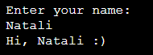
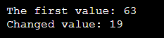
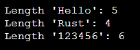
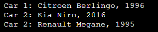
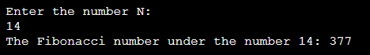
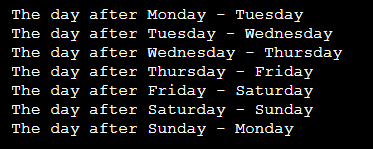
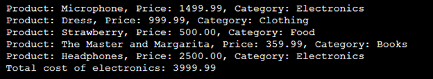
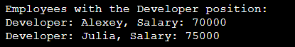

# Rust - Лабораторная работа № 1  

---

__Дисциплина:__   
Программирование. Язык СИ   

__Преподаватели:__   
Власов Дмитрий Викторович,   
Мельников Федор Владиславович   

__Учебное заведение:__   
РГПУ им. А. И. Герцена  

---

## Задание 1  
### Постановка задачи  
Напишите программу, которая запрашивает у пользователя имя и выводит на экран приветственное сообщение с использованием этого имени.  

### Список идентификаторов  

| Имя переменной | Тип данных | Смысловое обозначение      |
|----------------|------------|----------------------------|
| name           | String     | Имя пользователя           |

### Код программы  
```rust
use std::io;
fn main() {
    println!("Enter your name:");
    let mut name = String::new();
    io::stdin()
        .read_line(&mut name)
        .expect("Error");
    let name = name.trim();
    println!("Hi, {} :)", name);
}
```

### Результаты выполненной работы  


---

## Задание 2  
### Постановка задачи  
Создайте переменную типа целое беззнаковое число и выведите ее значение на экран. Явно укажите тип переменной. Затем измените значение переменной и снова выведите его.  

### Список идентификаторов  

| Имя переменной | Тип данных | Смысловое обозначение      |
|----------------|------------|----------------------------|
| num            | u32        | Числовое значение          |

### Код программы  
```rust
fn main() {
    let mut num: u32 = 63;
    println!("The first value: {}", num);
    num = 19;
    println!("Changed value: {}", num);
}
```

### Результаты выполненной работы  


---

## Задание 3  
### Постановка задачи  
Напишите функцию, которая принимает строку и возвращает ее длину (количество символов). Затем вызовите эту функцию с различными строками.  

### Список идентификаторов  

| Имя переменной       | Тип данных | Смысловое обозначение              |
|----------------------|------------|------------------------------------|
| string_length        | fn         | Функция для вычисления длины строки |
| s1, s2, s3           | String     | Тестовые строки                    |

### Код программы  
```rust
fn string_length(s: &str) -> usize {
    s.len()
}
fn main() {
    let s1 = "Hello";
    let s2 = "Rust";
    let s3 = "123456"; 
    println!("Length '{}': {}", s1, string_length(s1));
    println!("Length '{}': {}", s2, string_length(s2));
    println!("Length '{}': {}", s3, string_length(s3));
}
```

### Результаты выполненной работы  


---

## Задание 4  
### Постановка задачи  
Задайте структуру `Car` с полями `brand`, `model` и `year`, и создайте несколько экземпляров этой структуры. Выведите информацию о каждой машине на экран.  

### Список идентификаторов  

| Имя переменной | Тип данных | Смысловое обозначение               |
|----------------|------------|-------------------------------------|
| Car            | struct     | Структура автомобиля                |
| brand          | String     | Марка автомобиля                   |
| model          | String     | Модель автомобиля                  |
| year           | u16        | Год выпуска автомобиля             |

### Код программы  
```rust
struct Car {
    brand: String,
    model: String,  
    year: u16, 
}
fn main() {
    let car1 = Car {
        brand: String::from("Citroen"),
        model: String::from("Berlingo"),
        year: 1996,
    };
    let car2 = Car {
        brand: String::from("Kia"),
        model: String::from("Niro"),
        year: 2016,
    };
    let car3 = Car {
        brand: String::from("Renault"),
        model: String::from("Megane"),
        year: 1995,
    };
    println!("Car 1: {} {}, {}", car1.brand, car1.model, car1.year);
    println!("Car 2: {} {}, {}", car2.brand, car2.model, car2.year);
    println!("Car 2: {} {}, {}", car3.brand, car3.model, car3.year);
}
```

### Результаты выполненной работы  


---

## Задание 5  
### Постановка задачи  
Напишите программу, которая запрашивает у пользователя число $ N $ и выводит на экран $ N $-ное число Фибоначчи. Используйте рекурсию для решения этой задачи.  

### Список идентификаторов  

| Имя переменной | Тип данных | Смысловое обозначение                        |
|----------------|------------|----------------------------------------------|
| fibonacci      | fn         | Рекурсивная функция для вычисления n-го числа Фибоначчи |
| n              | u32        | Преобразованное число                       |

### Код программы  
```rust
use std::io;
fn fibonacci(n: u32) -> u64 {
    match n {
        0 => 0,
        1 => 1,
        _ => fibonacci(n - 1) + fibonacci(n - 2),
    }
}
fn main() {
    println!("Enter the number N:");
    let mut input = String::new();
    io::stdin()
        .read_line(&mut input)
        .expect("Error");
    let n: u32 = match input.trim().parse() {
        Ok(num) => num,
        Err(_) => {
            println!("Enter an integer");
            return; 
        }
    };
    println!("The Fibonacci number under the number {}: {}", n, fibonacci(n));
}  
```

### Результаты выполненной работы  


---

## Задание 6  
### Постановка задачи  
Реализуйте перечисление `DayOfWeek` для дней недели. Напишите функцию, которая принимает день недели и возвращает следующий день. Обработайте случаи перехода на следующий день недели, если текущий день – воскресенье.  

### Список идентификаторов  

| Имя переменной | Тип данных | Смысловое обозначение             |
|----------------|------------|-----------------------------------|
| DayOfWeek      | enum       | Перечисление дней недели          |
| next_day       | fn         | Возвращает следующий день недели  |

### Код программы  
```rust
#[derive(Debug, Clone, Copy)]
enum DayOfWeek {
    Monday,
    Tuesday,
    Wednesday,
    Thursday,
    Friday,
    Saturday,
    Sunday,
}
fn next_day(current_day: DayOfWeek) -> DayOfWeek {
    match current_day {
        DayOfWeek::Monday => DayOfWeek::Tuesday,
        DayOfWeek::Tuesday => DayOfWeek::Wednesday,
        DayOfWeek::Wednesday => DayOfWeek::Thursday,
        DayOfWeek::Thursday => DayOfWeek::Friday,
        DayOfWeek::Friday => DayOfWeek::Saturday,
        DayOfWeek::Saturday => DayOfWeek::Sunday,
        DayOfWeek::Sunday => DayOfWeek::Monday,
    }
}
fn main() {
    let days = [
        DayOfWeek::Monday,
        DayOfWeek::Tuesday,
        DayOfWeek::Wednesday,
        DayOfWeek::Thursday,
        DayOfWeek::Friday,
        DayOfWeek::Saturday,
        DayOfWeek::Sunday,
    ];
    for &day in &days {
        println!("The day after {:?} - {:?}", day, next_day(day));
    }
}
```

### Результаты выполненной работы  


---

## Задание 7  
### Постановка задачи  
Создайте структуру `Product` с полями `name`, `price` и `category`, а также перечисление (`enum`) `Category` для категорий товаров. Напишите метод для вывода информации о продукте и ассоциированную функцию для подсчета общей суммы товаров в заданной категории из массива продуктов.  

### Список идентификаторов  

| Имя переменной              | Тип данных | Смысловое обозначение                      |
|----------------------------|------------|---------------------------------------------|
| Category                   | enum       | Перечисление категорий товаров             |
| Product                    | struct     | Структура информации о товарах             |
| name                       | String     | Товар                                        |
| price                      | f64        | Цена                                         |
| category                   | Category   | Категория                                    |
| info                       | fn         | Функция для вывода информации                |
| total_price_by_category    | fn         | Функция для подсчета суммы цен по категориям |
| electronics_total          | f64        | Общая стоимость электроники                 |

### Код программы  
```rust
#[derive(Debug, PartialEq)]
enum Category {
    Electronics,
    Clothing,
    Food,
    Books,
}
struct Product {
    name: String,
    price: f64,
    category: Category,
}
impl Product {
    fn info(&self) {
        println!("Product: {}, Price: {:.2}, Category: {:?}", self.name, self.price, self.category);
    }
    fn total_price_by_category(products: &[Product], category: Category) -> f64 {
        products.iter()
            .filter(|p| p.category == category)
            .map(|p| p.price)
            .sum()
    }
}
fn main() {
    let products = vec![
        Product {
            name: String::from("Microphone"),
            price: 1499.99,
            category: Category::Electronics,
        },
        Product {
            name: String::from("Dress"),
            price: 999.99,
            category: Category::Clothing,
        },
        Product {
            name: String::from("Strawberry"),
            price: 500.0,
            category: Category::Food,
        },
        Product {
            name: String::from("The Master and Margarita"),
            price: 359.99,
            category: Category::Books,
        },
        Product {
            name: String::from("Headphones"),
            price: 2500.0,
            category: Category::Electronics,
        },
    ];
    for product in &products {
        product.info();
    }
    let electronics_total = Product::total_price_by_category(&products, Category::Electronics);
    println!("Total cost of electronics: {:.2}", electronics_total);
}
```

### Результаты выполненной работы  


---

## Задание 8  
### Постановка задачи  
Создайте структуру `Employee` с полями `name`, `position`, `salary`, а также перечисление `Position` для должностей сотрудников. Напишите функцию, которая принимает вектор сотрудников и возвращает вектор сотрудников заданной должности.  

### Список идентификаторов  

| Имя переменной        | Тип данных | Смысловое обозначение               |
|-----------------------|------------|-------------------------------------|
| Position              | enum       | Перечисление должностей             |
| Employee              | struct     | Структура информации о сотрудниках  |
| name                  | String     | Имя сотрудника                      |
| position              | Position   | Должность сотрудника                |
| salary                | u32        | Зарплата сотрудника                 |
| filter_by_position    | fn         | Функция фильтрации должностей        |

### Код программы  
```rust
#[derive(Debug, PartialEq)]
enum Position {
    Manager,
    Developer,
    Designer,
}
struct Employee {
    name: String,
    position: Position,
    salary: u32,
}
fn filter_by_position(employees: Vec<Employee>, position: Position) -> Vec<Employee> {
    employees.into_iter()
        .filter(|e| e.position == position)
        .collect()
}
fn main() {
    let employees = vec![
        Employee {
            name: String::from("Elizabeth"),
            position: Position::Manager,
            salary: 80000,
        },
        Employee {
            name: String::from("Alexey"),
            position: Position::Developer,
            salary: 70000,
        },
        Employee {
            name: String::from("Julia"),
            position: Position::Developer,
            salary: 75000,
        },
        Employee {
            name: String::from("Victoria"),
            position: Position::Designer,
            salary: 65000,
        },
    ];
    let developers = filter_by_position(employees, Position::Developer);
    println!("Employees with the Developer position:");
    for dev in developers {
        println!("Developer: {}, Salary: {}", dev.name, dev.salary);
    }
}
```

### Результаты выполненной работы  


---

### Информация о студенте
Лебедева Наталия, 1 курс, ИВТ-1.2
