# Лабораторная работа № 1

Математические операции. Переменные и их типы. Операторы. Циклы. Простые условные конструкции. Основы работы со статическими массивами.  
---

__Дисциплина:__   
Программирование. Язык СИ   

__Преподаватели:__   
Власов Дмитрий Викторович,   
Мельников Федор Владиславович   

__Учебное заведение:__   
РГПУ им. А. И. Герцена  

---

## Задание 1.2  

### Постановка задачи  
Написать простую программу. Ввести два числа с клавиатуры, вычислить их сумму и напечатать результат. Использовать функцию `printf` для приглашений на ввод и для распечатки результата. Использовать функцию `scanf` для ввода каждого числа отдельно с клавиатуры. Для получения доступа к функциям `printf` и `scanf` включить в программу заголовочный файл `stdio.h`. Использовать корректные спецификаторы форматирования. Здесь и далее для распечатки надписей на экране использовать латинские буквы для избежания проблем с кодировками символов.  

### Список идентификаторов  

| Имя переменной | Тип данных | Смысловое обозначение |
| --- | --- | --- |
| x | int | 1-е введенное значение с клавиатуры |
| y | int | 2-е введенное значение с клавиатуры |
| s | int | Результат вычисления |

### Код программы  
```c
#include <stdio.h>
int main() 
{
    int x, y, s;
    printf("Введите число x: ");
    scanf("%d", &x);
    printf("Введите число y: ");
    scanf("%d", &y);
    s = x + y;
    printf("Результат: %d\n", s);
    return 0;
}
```

### Результаты выполненной работы
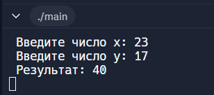

---

## Задание 1.3  

### Постановка задачи  
Вычислить значение выражения:  

$$
u(x, y) = \frac{1 + \sin^2(x + y)}{2 + \left| x - \frac{2x^2}{1 + |\sin(x + y)|} \right|}
$$  

введя `x` и `y` с клавиатуры. Подберите значения аргументов `x` и `y` самостоятельно за исключением тривиальных значений. Напечатайте вычисленное значение `u(x, y)` на экране. Включить в программу заголовочный файл `math.h` для доступа к математическим функциям.  

### Математическая модель  

$$
u(x, y) = \frac{1 + \sin^2(x + y)}{2 + \left| x - \frac{2x^2}{1 + |\sin(x + y)|} \right|}
$$  

### Список идентификаторов  

| Имя переменной | Тип данных | Смысловое обозначение |
| --- | --- | --- |
| x | int | 1-е введенное значение с клавиатуры |
| y | int | 2-е введенное значение с клавиатуры |
| u | int | Результат вычисления |

### Код программы  
```c
#include <stdio.h>
#include <math.h>
int main() 
{
    double x, y, u;
    printf("Введите число x: ");
    scanf("%le", &x);
    printf("Введите число y: ");
    scanf("%le", &y);
    u = (1 + sin(x + y) * sin(x + y)) / (2 + fabs(x - (2 * x * x) / (1 + fabs(sin(x + y)))));
    printf("Результат: %f\n", u);
    return 0;
}
```

### Результаты выполненной работы
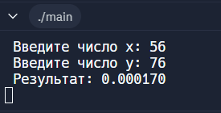

---

## Задание 1.4  

### Постановка задачи  
Вычислить значение выражения:  

$$
h(x) = -\frac{x - a}{\sqrt[3]{(x^2 + a^2)}} - \frac{4 \sqrt[4]{(x^2 + b^2)^3}}{2 + a + b + \sqrt[3]{(x - c)^2}}
$$  

Выполнить для следующих значений:  

$$ 
a = 0.12, b = 3.5, c = 2.4, x = 1.4;
$$ 

$$ 
a = 0.12, b = 3.5, c = 2.4, x = 1.6;
$$ 

$$ 
a = 0.27, b = 3.9, c = 2.8, x = 1.8.
$$ 

Значения параметров и аргументов можно вводить прямо в коде программы без ввода с клавиатуры.

### Математическая модель  

$$
h(x) = -\frac{x - a}{\sqrt[3]{(x^2 + a^2)}} - \frac{4 \sqrt[4]{(x^2 + b^2)^3}}{2 + a + b + \sqrt[3]{(x - c)^2}}
$$   

### Список идентификаторов  

| Имя переменной | Тип данных | Смысловое обозначение |
| --- | --- | --- |
| h1 | float | Результат вычисления |
| h2 | float | Результат вычисления |
| h3 | float | Результат вычисления |
| h | float | Промежуточная переменная |

### Код программы  
```c
#include <stdio.h>
#include <math.h>
float h(float a, float b, float c, float x)
{
    float h, x_a, x_b, x_c;
    x_a = x * x + a * a;
    x_b = x * x + b * b;
    x_c = (x - c) * (x - c);
    h = -(x - a) / pow(x_a, 1.0 / 3.0) - 4 * pow(x_b, 3.0 / 4.0) / (2 + a + b + pow(x_c, 1.0 / 3.0));
    return h;
}
int main() 
{
    float h1, h2, h3;
    h1 = h(0.12, 3.5, 2.4, 1.4);
    h2 = h(0.12, 3.5, 2.4, 1.6);
    h3 = h(0.27, 3.9, 2.8, 1.8);
    printf("Результат 1: %f\n", h1);
    printf("Результат 2: %f\n", h2);
    printf("Результат 3: %f\n", h3);
    return 0;
}
```

### Результаты выполненной работы
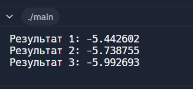

---

## Задание 2.1  

### Постановка задачи  
Вычислить используя цикл `for` координаты планеты Марс относительно Земли с течением времени `t`. Распечатать на экране координаты для каждой итерации по `t`. Координаты планеты Марс для каждой итерации задаются заданы формулами:  

$$
x = r_1 \cdot \cos(w_1 \cdot t) - r_2 \cdot \cos(w_2 \cdot t)
$$ 

$$ 
y = r_1 \cdot \sin(w_1 \cdot t) - r_2 \cdot \sin(w_2 \cdot t)
$$ 

$$ 
w_1 = \frac{2π}{Т_1}
$$ 

$$ 
w_2 = \frac{2π}{Т_2}
$$  

где $r_1$ – радиус орбиты Марса, $r_2$ – радиус орбиты Земли, $T_1$ и $T_2$ — периоды обращения указанных планет соответственно, `t` – каждый заданный момент времени внутри цикла по времени. Подберите подходящие единицы измерения для времени и расстояния.  

### Математическая модель  

$$
x = r_1 \cdot \cos(w_1 \cdot t) - r_2 \cdot \cos(w_2 \cdot t)
$$ 

$$ 
y = r_1 \cdot \sin(w_1 \cdot t) - r_2 \cdot \sin(w_2 \cdot t)
$$ 

$$ 
w_1 = \frac{2π}{Т_1}
$$ 

$$ 
w_2 = \frac{2π}{Т_2}
$$

### Список идентификаторов  

| Имя переменной | Тип данных | Смысловое обозначение |
| --- | --- | --- |
| r1 | double | 1-е введенное значение |
| r2 | double | 2-е введенное значение |
| T1 | double | 3-е введенное значение |
| T2 | double | 4-е введенное значение |
| pi | double | 5-е введенное значение |
| w1 | double | Промежуточная переменная |
| w2 | double | Промежуточная переменная |
| s | double | 6-е введенное значение |
| e | double | 7-е введенное значение |
| h | double | 8-е введенное значение |
| x | double | Результат вычисления |
| y | double | Результат вычисления |
| t | double | Параметр цикла |

### Код программы  
```c
#include <stdio.h>
#include <math.h>
double r1 = 1.524, r2 = 1.000, T1 = 687.0, T2 = 365.25, pi = 3.14, w1, w2, s = 0.0, e = 1400.0, h = 175.0, x, y;
int main() 
{
    w1 = 2 * pi / T1;
    w2 = 2 * pi / T2;
    for (double t = s; t <= e; t += h) 
    {
        x = r1 * cos(w1 * t) - r2 * cos(w2 * t);
        y = r1 * sin(w1 * t) - r2 * sin(w2 * t);
        printf("t: %f, x: %f, y: %f\n", t, x, y);
    }
    return 0;
}
```

### Результаты выполненной работы
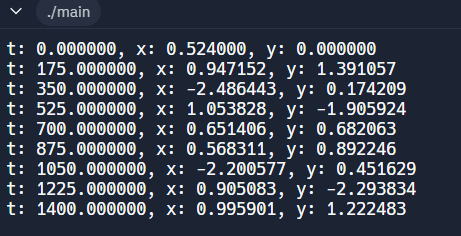

---

## Задание 2.2  

### Постановка задачи  
Вычислить определённый интеграл от заданной функции методом трапеций:  

$$
\int \limits_a^b f(x)dx = \int \limits_a^b e^{x+2}dx .
$$

Функция $f(x)$ может быть выбрана и самостоятельно. Результат интегрирования сравнить с вычисленным вручную и убедиться в корректности результата.  

### Математическая модель  

$$
\int \limits_a^b f(x)dx = h \cdot \Bigg( \frac{f(a) + f(b)}{2} + \sum_{x=a+h}^{b-h} f(x) \Bigg)
$$

### Список идентификаторов  

| Имя переменной | Тип данных | Смысловое обозначение |
| --- | --- | --- |
| a | double | 1-е введенное значение |
| b | double | 2-е введенное значение |
| x | double | Параметр цикла |
| h | double | Промежуточная переменная |
| t | double | 3-е введенное значение |
| n | double | 4-е введенное значение |
| f | double | Промежуточная переменная |
| S | double | Результат вычисления |
| fa | double | Промежуточная переменная |
| fb | double | Промежуточная переменная |

### Код программы  
```c
#include <stdio.h>
#include <math.h>
int main()
{
    double a = 0, b = 1, x, t = 0, h, f, S, fa, fb, n = 1000;
    h = (b - a) / n;
    for (x = a + h; x <= b - h; x += h)
    {
        f = exp(x + 2);
        t = t + f;
    }
    fa = exp(a + 2);
    fb = exp(b + 2);
    S = h * ((fa + fb) / 2 + t);
    printf("Integral ≈ %f\n", S);
    return 0;
}
```

### Результаты выполненной работы
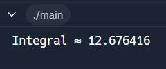

---

## Задание 2.3  

### Постановка задачи  
Организовать и распечатать последовательность чисел Падована, не превосходящих число `m`, введенное с клавиатуры. Числа Падована представлены следующим рядом:  
1, 1, 1, 2, 2, 3, 4, 5, 7, 9, 12, 16, 21, 28, 37, 49, 65, 86, 114, 151, 200, 265, ...  
Использовать конструкцию `for` и простые варианты условной конструкции `if else`. Для этих чисел заданы формулы:

$$
P(0) = P(1) = P(2) = 1
$$

$$
P(n) = P(n - 2) + P(n - 3)
$$

### Математическая модель  

$$
P(0) = P(1) = P(2) = 1
$$

$$
P(n) = P(n - 2) + P(n - 3)
$$

### Список идентификаторов  

| Имя переменной | Тип данных | Смысловое обозначение |
| --- | --- | --- |
| m | int | Введенное значение с клавиатуры |
| P[100] | int | Промежуточная переменная |
| n | int | Параметр цикла |

### Код программы  
```c
#include <stdio.h>
int main() 
{
    int m;
    printf("Введите число m: ");
    scanf("%d", &m);
    if (m <= 0) 
    {
        printf("Нет чисел Падована, не превышающих 0.\n");
        return 0; 
    }
    int P[100];
    for (int i = 0; i < 3; i++)
    {
        P[i] = 1;
        printf("%d ", P[i]);
    }
    for (int n = 3; n < 100; n++) 
    { 
        P[n] = P[n - 2] + P[n - 3];
        if (P[n] > m) 
        { 
            break; 
        } 
        printf("%d ", P[n]);
    }
    return 0;
}
```

### Результаты выполненной работы
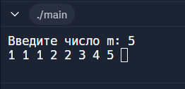

---

## Задание 2.4  

### Постановка задачи  
С клавиатуры вводится трёхзначное число, считается сумма его цифр. Если сумма цифр числа больше 10, то вводится следующее трёхзначное число, если сумма меньше либо равна 10 — программа завершается.  

### Список идентификаторов  

| Имя переменной | Тип данных | Смысловое обозначение |
| --- | --- | --- |
| n | int | Введенное значение с клавиатуры |
| s | int | Результат вычисления |

### Код программы  
```c
#include <stdio.h>
int main() 
{
    int n, s;
    while (1) 
    {
        printf("Введите трёхзначное число: ");
        scanf("%d", &n);
        if (n >= 100 && n <= 999) 
        {
            s = (n / 100) + (n / 10 % 10) + (n % 10);
            if (s <= 10) 
            {
                printf("Сумма цифр числа равна %d.\n", s);
                break;
            } 
            else  
            {
                printf("Сумма цифр числа равна %d. Вводите следующее число.\n", s);
            }
        } 
        else  
        {
            printf("Ошибка: необходимо ввести трёхзначное число.\n");
        }
    }
    return 0;
}
```

### Результаты выполненной работы
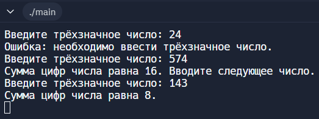

---

## Задание 3.1  

### Постановка задачи  
Для некоторого числового вектора `X`, введённого с клавиатуры, вычислить значения вектора $Y = X · X$ ($y_i$  = $x_i$  · $x_i$ — поэлементно). 

### Список идентификаторов  

| Имя переменной | Тип данных | Смысловое обозначение |
| --- | --- | --- |
| n | int | Введенное значение с клавиатуры |
| X[n] | int | Промежуточная переменная |
| Y[n] | int | Промежуточная переменная |
| i | int | Параметр цикла |

### Код программы  
```c
#include <stdio.h>
int main() 
{
    int n;
    printf("Введите количество элементов вектора X: ");
    scanf("%d", &n);
    int X[n], Y[n];
    printf("Введите элементы вектора X:\n");
    for (int i = 0; i < n; i++) 
    {
        scanf("%d", &X[i]);
        Y[i] = X[i] * X[i];
    }
    printf("Вектор Y (поэлементные квадраты):\n");
    for (int i = 0; i < n; i++) 
    {
        printf("%d ", Y[i]);
    }
    return 0;
}
```

### Результаты выполненной работы
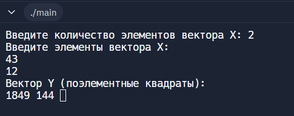

---

## Задание 3.2  

### Постановка задачи  
Для некоторого числового массива `X`, введённого с клавиатуры поэлементно, изменить порядок элементов на обратный и распечатать результат на экране.  

### Список идентификаторов  

| Имя переменной | Тип данных | Смысловое обозначение |
| --- | --- | --- |
| n | int | Введенное значение с клавиатуры |
| X[n] | int | Промежуточная переменная |
| i | int | Параметр цикла |

### Код программы  
```c
#include <stdio.h>
int main() 
{
    int n;
    printf("Введите количество элементов массива X: ");
    scanf("%d", &n);
    int X[n];
    
    printf("Введите элементы массива X:\n");
    for (int i = 0; i < n; i++) 
    {
        scanf("%d", &X[i]);
    }
    
    for (int i = 0; i < n / 2; i++) 
    {
        int t = X[i];
        X[i] = X[n - 1 - i];
        X[n - 1 - i] = t;
    }
    
    printf("Элементы массива X в обратном порядке:\n");
    for (int i = 0; i < n; i++) 
    {
        printf("%d ", X[i]);
    }
    return 0;
}
```

### Результаты выполненной работы
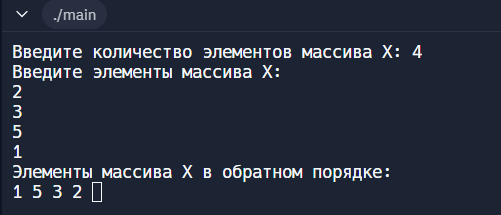

---

## Задание 3.3  

### Постановка задачи  
Транспонировать матрицу:  

$$
A = 
\begin{bmatrix} 
1 & 2 & 3 \\ 
4 & 5 & 6 \\
7 & 8 & 9 
\end{bmatrix}
$$

### Список идентификаторов  

| Имя переменной | Тип данных | Смысловое обозначение |
| --- | --- | --- |
| A[3][3] | int | Введенное значение |
| B[3][3] | int | Введенное значение |
| i | int | Параметр цикла |
| j | int | Параметр цикла |

### Код программы  
```c
#include <stdio.h>
int main() 
{
    int A[3][3] = {{1, 2, 3}, {4, 5, 6}, {7, 8, 9}};
    int B[3][3];
    for (int i = 0; i < 3; i++) 
    {
        for (int j = 0; j < 3; j++) 
        {
            B[j][i] = A[i][j];
        }
    }
    printf("Транспонированная матрица:\n");
    for (int i = 0; i < 3; i++) 
    {
        for (int j = 0; j < 3; j++) 
        {
            printf("%d ", B[i][j]);
        }
        printf("\n");
    }
    return 0;
}
```

### Результаты выполненной работы
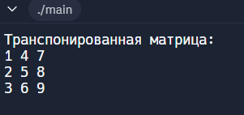

---

## Задание 3.4  

### Постановка задачи  
Преобразовать исходную матрицу так, чтобы первый элемент каждой строки был заменён средним арифметическим элементов этой строки.  

### Список идентификаторов  

| Имя переменной | Тип данных | Смысловое обозначение |
| --- | --- | --- |
| A[3][3] | int | Введенное значение |
| s | int | Промежуточная переменная |
| i | int | Параметр цикла |
| j | int | Параметр цикла |

### Код программы  
```c
#include <stdio.h>
int main() 
{
    int A[3][3] = {{1, 2, 3}, {4, 5, 6}, {7, 8, 9}};
    for (int i = 0; i < 3; i++) 
    {
        int s = 0;
        for (int j = 0; j < 3; j++) 
        {
            s += A[i][j];
        }
        A[i][0] = s / 3;
    }
    printf("Результат:\n");
    for (int i = 0; i < 3; i++) 
    {
        for (int j = 0; j < 3; j++) 
        {
            printf("%d ", A[i][j]);
        }
        printf("\n");
    }
    return 0;
}
```

### Результаты выполненной работы
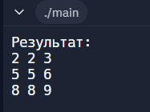

---

## Задание 3.5  

### Постановка задачи  
Реализовать самостоятельно алгоритм сортировки вставками (без создания своих функций, внутри функции `main`).  

### Список идентификаторов  

| Имя переменной | Тип данных | Смысловое обозначение |
| --- | --- | --- |
| n | int | Введенное значение с клавиатуры |
| A[n] | int | Промежуточная переменная |
| i | int | Параметр цикла |
| j | int | Параметр цикла |
| t | int | Промежуточная переменная |

### Код программы  
```c
#include <stdio.h>
int main() 
{
    int n;
    printf("Введите количество элементов массива: ");
    scanf("%d", &n);
    int A[n];
    printf("Введите элементы массива:\n");
    for (int i = 0; i < n; i++) 
    {
        scanf("%d", &A[i]);
    }
    for (int i = 1; i < n; i++) 
    {
        for (int j = i; j > 0 && A[j - 1] > A[j]; j--) 
        {
            int t = A[j - 1];
            A[j - 1] = A[j];
            A[j] = t;
        }
    }
    printf("Отсортированный массив:\n");
    for (int i = 0; i < n; i++) {
        printf("%d ", A[i]);
    }
    return 0;
}
```

### Результаты выполненной работы
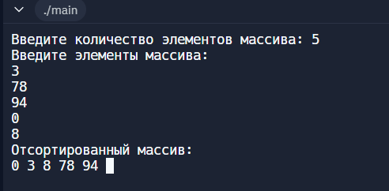

---

### Информация о студенте  
Лебедева Наталия, 1 курс, ИВТ-1.2
