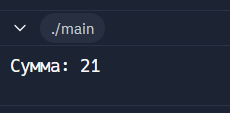
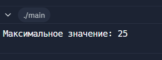
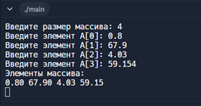
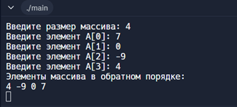
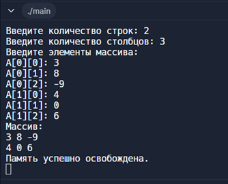

# Лабораторная работа №2

Указатели, арифметика указателей  
---

__Дисциплина:__   
Программирование. Язык СИ   

__Преподаватели:__   
Власов Дмитрий Викторович,   
Мельников Федор Владиславович   

__Учебное заведение:__   
РГПУ им. А. И. Герцена  

---

## Задание 1

### Постановка задачи
Внутри функции `int main(void)` определите указатель `double ***pointer = NULL;`. Инициализируйте этот указатель адресом другого указателя типа `double **`, который указывает на переменную `double *`, которая указывает на `double`. Используйте `pointer` для записи и чтения значения `2.0` в сегмент оперативной памяти для `double`.

### Список идентификаторов
| Имя переменной | Тип данных | Смысловое обозначение |
|---------------|------------|-----------------------|
| pointer       | double***  | Промежуточная переменная |
| *pointer      | double**   | Промежуточная переменная |
| **pointer     | double*    | Промежуточная переменная |
| ***pointer    | double     | Результат |

### Код программы
```c
#include <stdio.h>
#include <stdlib.h>

int main(void)
{
    double ***pointer = NULL;
    // Выделяем память для первого уровня (указатель на указатель на указатель).
    *( *( *(pointer = (double ***)malloc(sizeof(double **))) 
        // Выделяем память для второго уровня (указатель на указатель).
        = (double **)malloc(sizeof(double *)))  
        // Выделяем память для третьего уровня (указатель на значение).
        = (double *)malloc(sizeof(double)))  
        // Присваиваем значение `2.0` в выделенную память.
        = 2.0;

    // Печатаем значение, на которое указывает `pointer`.
    printf("Результат: %lf\n", ***pointer);

    // Освобождаем память в обратном порядке её выделения:
    free(**pointer);
    free(*pointer);
    free(pointer);

    return 0;
}
```

### Результаты выполненной работы


---

## Задание 2

### Постановка задачи
Напишите программу, которая складывает два числа с использованием указателей на эти числа.

### Список идентификаторов
| Имя переменной | Тип данных | Смысловое обозначение |
|---------------|------------|-----------------------|
| a             | int        | Константа |
| b             | int        | Константа |
| p_a           | int*       | Промежуточная переменная |
| p_b           | int*       | Промежуточная переменная |
| sum           | int        | Результат вычисления |

### Код программы
```c
#include <stdio.h>

int main(void) 
{
    int a = 13, b = 8, sum;
    int *p_a = &a, *p_b = &b;
    sum = *p_a + *p_b;
    printf("Сумма: %d\n", sum);
    return 0;
}
```

### Результаты выполненной работы
[](https://github.com/nataliswan/program/blob/main/lab%202/pictures/2.png)

---

## Задание 3

### Постановка задачи
Напишите программу, которая находит максимальное число из двух чисел, используя указатели на эти числа.

### Список идентификаторов
| Имя переменной | Тип данных | Смысловое обозначение |
|---------------|------------|-----------------------|
| a             | int        | Константа |
| b             | int        | Константа |
| p_a           | int*       | Промежуточная переменная |
| p_b           | int*       | Промежуточная переменная |
| max           | int        | Результат вычисления |

### Код программы
```c
#include <stdio.h>

int main(void) 
{
    int a = 7, b = 25, max;
    int *p_a = &a, *p_b = &b;
    max = (*p_a > *p_b) ? *p_a : *p_b;
    printf("Максимальное значение: %d\n", max);
    return 0;
}
```

### Результаты выполненной работы
[](https://github.com/nataliswan/program/blob/main/lab%202/pictures/3.png)

---

## Задание 4

### Постановка задачи
Напишите программу, которая создаёт одномерный динамический массив из чисел с плавающей точкой двойной точности, заполняет его значениями с клавиатуры и распечатывает все элементы этого массива, используя арифметику указателей (оператор `+`), а не оператор доступа к элементу массива `[]`.

### Список идентификаторов
| Имя переменной | Тип данных | Смысловое обозначение |
|---------------|------------|-----------------------|
| n             | int        | Введенное значение с клавиатуры |
| i             | int        | Параметр цикла |
| A             | double*    | Результат вычисления |

### Код программы
```c
#include <stdio.h>
#include <stdlib.h>

int main(void) 
{
    int n;
    printf("Введите размер массива: ");
    scanf("%d", &n);
    double *A = (double *)malloc(n * sizeof(double));
    if (A == NULL) 
    {
        printf("Ошибка выделения памяти\n");
        return 1;
    }
    for (int i = 0; i < n; i++)
    {
        printf("Введите элемент A[%d]: ", i);
        scanf("%lf", A + i);
    }
    printf("Элементы массива:\n");
    for (int i = 0; i < n; i++) 
    {
        printf("%.2lf ", *(A + i));
    }
    printf("\n");
    free(A);
    return 0;
}
```

### Результаты выполненной работы
[](https://github.com/nataliswan/program/blob/main/lab%202/pictures/4.png)

---

## Задание 5

### Постановка задачи
Выведите элементы динамического массива целых чисел в обратном порядке, используя указатель и операцию декремента (`--`).

### Список идентификаторов
| Имя переменной | Тип данных | Смысловое обозначение |
|---------------|------------|-----------------------|
| n             | int        | Введенное значение с клавиатуры |
| i             | int        | Параметр цикла |
| A             | int*       | Промежуточная переменная |
| ptr           | int*       | Промежуточная переменная |

### Код программы
```c
#include <stdio.h>
#include <stdlib.h>

int main(void) 
{
    int n;
    printf("Введите размер массива: ");
    scanf("%d", &n);
    int *A = (int *)malloc(n * sizeof(int));
    if (A == NULL) 
    {
        printf("Ошибка выделения памяти\n");
        return 1;
    }
    for (int i = 0; i < n; i++)
    {
        printf("Введите элемент A[%d]: ", i);
        scanf("%d", A + i);
    }
    int *ptr = A + n - 1;
    printf("Элементы массива в обратном порядке:\n");
    for (int i = 0; i < n; i++) 
    {
        printf("%d ", *ptr);
        ptr--;
    }
    printf("\n");
    free(A);
    return 0;
}
```

### Результаты выполненной работы
[](https://github.com/nataliswan/program/blob/main/lab%202/pictures/5.png)

---

## Задание 6

### Постановка задачи
Определите переменную целого типа `int a = 1234567890;` и выведите побайтово её содержимое на экран, используя указатель `char *`.

### Список идентификаторов
| Имя переменной | Тип данных | Смысловое обозначение |
|---------------|------------|-----------------------|
| a             | int        | Константа |
| ptr           | char*      | Промежуточная переменная |
| i             | int        | Параметр цикла |

### Код программы
```c
#include <stdio.h>

int main() 
{
    int a = 1234567890; 
    unsigned char *ptr = (unsigned char *)&a; 
    for (int i = 0; i < sizeof(int); i++) 
    {
        printf("Byte %d: %d\n", i, (unsigned char)ptr[i]);
    }
    return 0;
}
```

### Результаты выполненной работы


---

## Задание 7

### Постановка задачи
Выделите память под двумерный динамический массив, используя массив указателей на строки, и затем корректно освободите оперативную память.

### Список идентификаторов
| Имя переменной | Тип данных | Смысловое обозначение |
|---------------|------------|-----------------------|
| rows          | int        | 1-е введенное значение с клавиатуры |
| cols          | int        | 2-е введенное значение с клавиатуры |
| i             | int        | Параметр цикла |
| j             | int        | Параметр цикла |
| A             | int**      | Промежуточная переменная |

### Код программы
```c
#include <stdio.h>
#include <stdlib.h>

int main() 
{
    int rows, cols;
    printf("Введите количество строк: ");
    scanf("%d", &rows);
    printf("Введите количество столбцов: ");
    scanf("%d", &cols);
    int **A = (int **)malloc(rows * sizeof(int *));
    if (A == NULL) 
    {
        printf("Ошибка выделения памяти\n");
        return 1;
    }
    for (int i = 0; i < rows; i++) 
    {
        A[i] = (int *)malloc(cols * sizeof(int));
        if (A[i] == NULL) 
        {
            printf("Ошибка выделения памяти для строки %d\n", i);
            for (int j = 0; j < i; j++) 
            {
                free(A[j]);
            }
            free(A);
            return 1;
        }
    }
    printf("Введите элементы массива:\n");
    for (int i = 0; i < rows; i++) 
    {
        for (int j = 0; j < cols; j++) 
        {
            printf("A[%d][%d]: ", i, j);
            scanf("%d", &A[i][j]);
        }
    }
    printf("Массив:\n");
    for (int i = 0; i < rows; i++) 
    {
        for (int j = 0; j < cols; j++) 
        {
            printf("%d ", A[i][j]);
        }
        printf("\n");
    }
    for (int i = 0; i < rows; i++) 
    {
        free(A[i]); 
    }
    free(A); 
    printf("Память успешно освобождена.\n");
    return 0;
}
```

### Результаты выполненной работы
[](https://github.com/nataliswan/program/blob/main/lab%202/pictures/7.png)

---

### Информация о студенте
Лебедева Наталия, 1 курс, ИВТ-1.2
