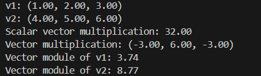
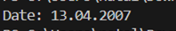
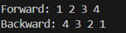
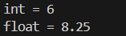
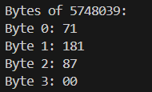
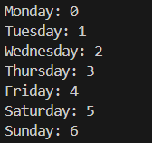
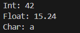

# Лабораторная работа №3

---

__Дисциплина:__   
Программирование. Язык СИ   

__Преподаватели:__   
Власов Дмитрий Викторович,   
Мельников Федор Владиславович   

__Учебное заведение:__   
РГПУ им. А. И. Герцена  

---
## Задание 1.1

### Постановка задачи
Создать некоторую структуру с указателем на некоторую функцию в качестве поля. Вызвать эту функцию через имя переменной этой структуры и поле указателя на функцию.

### Список идентификаторов

| Имя переменной | Тип данных | Смысловое обозначение |
| --- | --- | --- |
| func | `void()` | Тестовая функция для демонстрации |
| Struct | `struct` | Структура с указателем на функцию |
| func_ptr | `void(*)()` | Указатель на функцию |
| t | `struct Struct` | Переменная, через которую вызывается функция. |

### Код программы

```c
#include <stdio.h>
#include <stdlib.h>

void func() {
    printf("Good job :)\n");
}

struct Struct {
    void (*func_ptr)();
};

int main() {
    struct Struct t;
    t.func_ptr = func;
    t.func_ptr();
    return 0;
}
```

### Результаты выполненной работы


---

## Задание 1.2

### Постановка задачи
Создать структуру для вектора в 3-х мерном пространстве. Реализовать и использовать в своей программе следующие операции над векторами:
- скалярное умножение векторов;  
- векторное произведение;  
- модуль вектора;  
- распечатка вектора в консоли.  

В структуре вектора указать имя вектора в качестве отдельного поля этой структуры.

### Математическая модель
Скалярное произведение:  

$$
\vec{a} \cdot \vec{b} = a_x b_x + a_y b_y + a_z b_z
$$

Векторное произведение:  

$$
\vec{a} \times \vec{b} = 
\begin{vmatrix}
\vec{i} & \vec{j} & \vec{k} \\
a_x & a_y & a_z \\
b_x & b_y & b_z
\end{vmatrix} 
= \vec{i} \cdot (a_y b_z - a_z b_y) - \vec{j} \cdot (a_x b_z - a_z b_x) + \vec{k} \cdot (a_x b_y - a_y b_x)
$$

Модуль вектора:  

$$
|v| = \sqrt{v_x^2 + v_y^2 + v_z^2}
$$

### Список идентификаторов

| Имя переменной | Тип данных | Смысловое обозначение |
| --- | --- | --- |
| Vector | `struct` | Структура для 3D вектора |
| x, y, z | `double` | Координаты вектора |
| scalar_multiplication | `double` | Скалярное произведение векторов |
| vector_multiplication | `Vector` | Векторное произведение |
| vector_module | `double` | Модуль вектора |
| print_vector | `void` | Функция для вывода вектора |
| v1, v2 | `Vector` | Тестовые векторы |
| t | `Vector` | Результат векторного произведения |

### Код программы

```c
#include <stdio.h>
#include <math.h>

typedef struct {
    char name[20];
    double x, y, z;
} Vector;

// Скалярное произведение
double scalar_multiplication(Vector a, Vector b) {
    return a.x * b.x + a.y * b.y + a.z * b.z;
}

// Векторное произведение
Vector vector_multiplication(Vector a, Vector b) {
    Vector result;
    result.x = a.y * b.z - a.z * b.y;
    result.y = a.z * b.x - a.x * b.z;
    result.z = a.x * b.y - a.y * b.x;
    return result;
}

// Модуль вектора
double vector_module(Vector v) {
    return sqrt(v.x * v.x + v.y * v.y + v.z * v.z);
}

void print_vector(Vector v) {
    printf("%s: (%.2f, %.2f, %.2f)\n", v.name, v.x, v.y, v.z);
}

int main() {
    Vector v1 = {"v1", 1, 2, 3};
    Vector v2 = {"v2", 4, 5, 6};
    print_vector(v1);
    print_vector(v2);
    printf("Scalar vector multiplication: %.2f\n", scalar_multiplication(v1, v2));
    Vector t = vector_multiplication(v1, v2);
    printf("Vector multiplication");
    print_vector(t);
    printf("Vector module of v1: %.2f\n", vector_module(v1));
    printf("Vector module of v2: %.2f\n", vector_module(v2));
    return 0;
}
```

### Результаты выполненной работы


---

## Задание 1.3

### Постановка задачи
Вычислить, используя структуру комплексного числа, комплексную экспоненту $\exp{z}$ некоторого $z \in \mathbb{C}$.

### Математическая модель

$$
\exp{z} = 1 + z + \frac{1}{2!}z^2 + \frac{1}{3!}z^3 + \dots + \frac{1}{n!}z^n
$$

### Список идентификаторов

| Имя переменной | Тип данных | Смысловое обозначение |
| --- | --- | --- |
| Complex | `struct` | Структура для комплексного числа |
| real | `double` | Действительная часть комплексного числа |
| imag | `double` | Мнимая часть комплексного числа |
| multiply_complex | `Complex` | Умножение комплексных чисел |
| add_complex | `Complex` | Сложение комплексных чисел |
| complex_exp | `Complex` | Вычисление экспоненты (ряд Тейлора) |
| z | `Complex` | Входное комплексное число |
| n_terms | `int` | Количество членов ряда |
| result | `Complex` | Текущий результат ряда |
| term | `Complex` | Текущий член ряда |
| exp_z | `Complex` | Результат вычисления экспоненты |

### Код программы

```c
#include <stdio.h>
#include <math.h>

typedef struct {
    double real, imag;
} Complex;

// Умножение комплексных чисел
Complex multiply_complex(Complex a, Complex b) {
    Complex result;
    result.real = a.real * b.real - a.imag * b.imag;
    result.imag = a.real * b.imag + a.imag * b.real;
    return result;
}

// Сложение комплексных чисел
Complex add_complex(Complex a, Complex b) {
    Complex result;
    result.real = a.real + b.real;
    result.imag = a.imag + b.imag;
    return result;
}

// Вычисление exp(z) с помощью ряда Тейлора
Complex complex_exp(Complex z, int n_terms) {
    Complex result = {1, 0};
    Complex term = {1, 0};
    for (int i = 1; i <= n_terms; i++) {
        term = multiply_complex(term, z);
        term.real /= i;
        term.imag /= i;
        result = add_complex(result, term);
    }
    return result;
}

int main() {
    Complex z = {2, 1};
    int n_terms = 25;
    Complex exp_z = complex_exp(z, n_terms);
    printf("exp(%f + %fi) = %.6f + %.6fi\n", z.real, z.imag, exp_z.real, exp_z.imag);
    return 0;
}
```

### Результаты выполненной работы


---

## Задание 1.4

### Постановка задачи
Используя так называемые "битовые" поля в структуре C, создать экономную структуру в оперативной памяти для заполнения даты некоторого события, например даты рождения человека.

### Список идентификаторов

| Имя переменной | Тип данных | Смысловое обозначение |
| --- | --- | --- |
| Date | `struct` | Дата в битовых полях |
| day | `unsigned int: 5` | День (5 бит) |
| month | `unsigned int: 4` | Месяц (4 бита) |
| year | `unsigned int: 12` | Год (12 бит) |
| date | `Date` | Экземпляр структуры даты |

### Код программы

```c
#include <stdio.h>

typedef struct {
    unsigned int day : 5;
    unsigned int month : 4;
    unsigned int year : 12;
} Date;

int main() {
    Date date = {13, 4, 2007};
    printf("Date: %02u.%02u.%04u\n", date.day, date.month, date.year);
    return 0;
}
```

### Результаты выполненной работы


---

## Задание 1.5

### Постановка задачи
Реализовать в виде структур двунаправленный связный список и совершить отдельно его обход в прямом и обратном направлениях с распечаткой значений каждого элемента списка.

### Список идентификаторов

| Имя переменной | Тип данных | Смысловое обозначение |
| --- | --- | --- |
| Node | `struct` | Узел списка |
| data | `int` | Значение узла |
| prev | `struct Node*` | Указатель на предыдущий узел |
| next | `struct Node*` | Указатель на следующий узел |
| create_node | `struct Node*` | Создание нового узла |
| append | `void` | Добавление узла в конец |
| head | `struct Node*` | Начало списка |
| last | `struct Node*` | Последний узел списка |
| new_node | `struct Node*` | Новый узел |
| print_forward | `void` | Печать списка в прямом порядке |
| print_backward | `void` | Печать списка в обратном порядке |
| free_list | `void` | Освобождение памяти |
| temp | `struct Node*` | Временный указатель для освобождения |

### Код программы

```c
#include <stdio.h>
#include <stdlib.h>

// Узел двусвязного списка
struct Node {
    int data;
    struct Node *prev;
    struct Node *next;
};

// Создание нового узла
struct Node* create_node(int data) {
    struct Node* node = (struct Node*)malloc(sizeof(struct Node));
    node->data = data;
    node->prev = NULL;
    node->next = NULL;
    return node;
}

// Добавление узла в конец списка
void append(struct Node** head, int data) {
    struct Node* new_node = create_node(data);

    if (*head == NULL) {
        *head = new_node;
        return;
    }

    struct Node* last = *head;
    while (last->next != NULL) {
        last = last->next;
    }

    last->next = new_node;
    new_node->prev = last;
}

void print_forward(struct Node* node) {
    printf("Forward: ");
    while (node != NULL) {
        printf("%d ", node->data);
        node = node->next;
    }
    printf("\n");
}

void print_backward(struct Node* node) {
    if (node == NULL) return;

    while (node->next != NULL) {
        node = node->next;
    }

    printf("Backward: ");
    while (node != NULL) {
        printf("%d ", node->data);
        node = node->prev;
    }
    printf("\n");
}

// Освобождение памяти списка
void free_list(struct Node* head) {
    struct Node* temp;
    while (head != NULL) {
        temp = head;
        head = head->next;
        free(temp);
    }
}

int main() {
    struct Node* head = NULL;

    append(&head, 1);
    append(&head, 2);
    append(&head, 3);
    append(&head, 4);

    print_forward(head);
    print_backward(head);

    free_list(head);

    return 0;
}
```

### Результаты выполненной работы


---

## Задание 2.1

### Постановка задачи
Напишите программу, которая использует указатель на некоторое объединение `union`.

### Список идентификаторов

| Имя переменной | Тип данных | Смысловое обозначение |
| --- | --- | --- |
| Data | `union` | Объединение для разных типов данных |
| i | `int` | Целое число |
| f | `float` | Вещественное число |
| data | `union Data` | Экземпляр объединения |
| ptr | `union Data*` | Указатель на объединение |

### Код программы

```c
#include <stdio.h>

union Data {
    int i;
    float f;
};

int main() {
    union Data data;
    union Data *ptr = &data;

    ptr->i = 6;
    printf("int = %d\n", ptr->i);

    ptr->f = 8.25;
    printf("float = %.2f\n", ptr->f);

    return 0;
}
```

### Результаты выполненной работы


---

## Задание 2.2

### Постановка задачи
Напишите программу, которая использует `union` для побайтовой распечатки типа `unsigned long`.

### Список идентификаторов

| Имя переменной | Тип данных | Смысловое обозначение |
| --- | --- | --- |
| Byte | `union` | Объединение для доступа к байтам числа |
| N | `unsigned long` | Число |
| b | `unsigned char[]` | Массив байтов числа |
| view | `union Byte` | Экземпляр объединения |

### Код программы

```c
#include <stdio.h>

union Byte {
    unsigned long N;
    unsigned char b[sizeof(unsigned long)];
};

int main() {
    union Byte view;
    view.N = 5748039;
    printf("Bytes of %lu:\n", view.N);
    for (int i = 0; i < sizeof(unsigned long); i++) {
        printf("Byte %d: %02d\n", i, view.b[i]);
    }
    return 0;
}
```

### Результаты выполненной работы


---

## Задание 2.3

### Постановка задачи
Создайте перечислимый тип данных (`enum`) для семи дней недели и распечатайте на экране его значения, как целые числа.

### Список идентификаторов

| Имя переменной | Тип данных | Смысловое обозначение |
| --- | --- | --- |
| Days | `enum` | Дни недели |
| Monday | `int (0)` | Понедельник |
| Tuesday | `int (1)` | Вторник |
| … | … | Остальные дни |

### Код программы

```c
#include <stdio.h>

enum Days {
    Monday, Tuesday, Wednesday, Thursday, Friday, Saturday, Sunday
};

int main() {
    printf("Monday: %d\n", Monday);
    printf("Tuesday: %d\n", Tuesday);
    printf("Wednesday: %d\n", Wednesday);
    printf("Thursday: %d\n", Thursday);
    printf("Friday: %d\n", Friday);
    printf("Saturday: %d\n", Saturday);
    printf("Sunday: %d\n", Sunday);
    return 0;
}
```

### Результаты выполненной работы


---

## Задание 2.4

#### Постановка задачи
Создайте так называемое размеченное объединение `union`, которое заключено в виде поля структуры `struct` вместе с ещё одним полем, которое является перечислением `enum` и служит индикатором того, что именно на текущий момент хранится в таком вложенном объединении. Создать и заполнить динамический массив таких структур с объединениями внутри, заполняя вспомогательное поле перечисления `enum` для сохранения информации о хранимом в каждом размеченном объединении типе данных. Реализовать распечатку данных массива таких структур в консоль.

### Список идентификаторов

| Имя переменной | Тип данных | Смысловое обозначение |
| --- | --- | --- |
| Type | `enum` | Тип хранимых данных |
| int_type | `int` | Целое число |
| float_type | `int` | Вещественное число |
| char_type | `int` | Символ |
| Data | `union` | Объединение для хранения данных |
| i | `int` | Целое число |
| f | `float` | Вещественное число |
| c | `char` | Символ |
| Variant | `struct` | Размеченное объединение |
| type | `enum Type` | Тип данных в объединении |
| data | `union Data` | Данные |
| array | `Variant*` | Динамический массив структур |
| print_typed_data | `void` | Печать данных с учётом типа |

### Код программы

```c
#include <stdio.h>
#include <stdlib.h>

enum Type {
    int_type, float_type, char_type
};

union Data {
    int i;
    float f;
    char c;
};

typedef struct {
    enum Type type;
    union Data data;
} Variant;

void print_typed_data(Variant* variant) {
    switch (variant->type) {
        case int_type:
            printf("Int: %d\n", variant->data.i);
            break;
        case float_type:
            printf("Float: %.2f\n", variant->data.f);
            break;
        case char_type:
            printf("Char: %c\n", variant->data.c);
            break;
    }
}

int main() {
    Variant* array = malloc(3 * sizeof(Variant));
    array[0].type = int_type;
    array[0].data.i = 42;
    array[1].type = float_type;
    array[1].data.f = 15.24;
    array[2].type = char_type;
    array[2].data.c = 'a';
    for (int i = 0; i < 3; i++) {
        print_typed_data(&array[i]);
    }
    free(array);
    return 0;
}
```

### Результаты выполненной работы


---

### Информация о студенте
Лебедева Наталия, 1 курс, ИВТ-1.2
