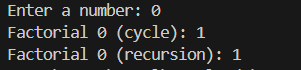
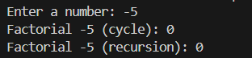
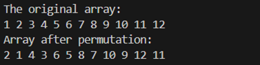
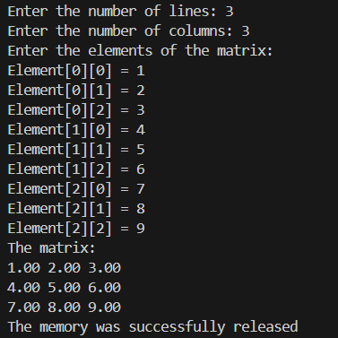
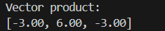
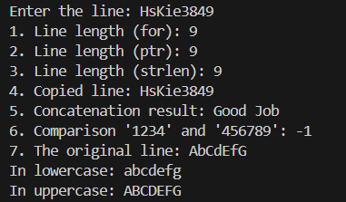
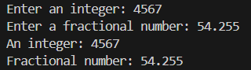
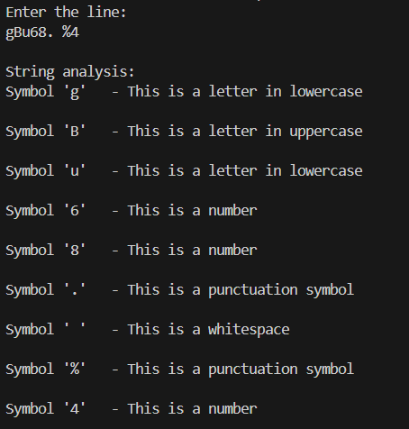

# Лабораторная работа №4

Введение в функции. Базовая работа со строками (однобайтовыми).
---

__Дисциплина:__   
Программирование. Язык СИ   

__Преподаватели:__   
Власов Дмитрий Викторович,   
Мельников Федор Владиславович   

__Учебное заведение:__   
РГПУ им. А. И. Герцена  

---

## Задание 1.1

### Постановка задачи
Создайте две функции, которые вычисляют факториал числа:  
- функцию, которая вычисляет факториал, используя цикл;  
- функцию, которая вычисляет факториал, используя рекурсивный вызов самой себя.  

Продемонстрируйте работу обеих функций.

### Список идентификаторов

| Имя переменной | Тип данных             | Смысловое обозначение                            |
|----------------|------------------------|--------------------------------------------------|
| factorial_1    | unsigned long long     | Функция вычисления факториала через цикл         |
| factorial_2    | unsigned long long     | Функция вычисления факториала через рекурсию     |
| n              | int                    | Входное число для вычисления факториала          |
| result         | unsigned long long     | Накопленный результат факториала в цикле        |
| i              | int                    | Параметр цикла                                   |
| num            | int                    | Число, для которого вычисляется факториал       |

### Код программы

```c
#include <stdio.h>
#include <stdlib.h>

// Вычисление факториала с использованием цикла
unsigned long long factorial_1(int n) {
    if (n < 0) return 0;
    unsigned long long result = 1;
    for (int i = 1; i <= n; ++i) {
        result *= i;
    }
    return result;
}

// Вычисление факториала с использованием рекурсии
unsigned long long factorial_2(int n) {
    if (n < 0) return 0;
    if (n == 0 || n == 1) return 1;
    return n * factorial_2(n - 1);
}

int main() {
    int num;
    printf("Enter a number: ");
    scanf("%d", &num);
    printf("Factorial %d (cycle): %llu\n", num, factorial_1(num));
    printf("Factorial %d (recursion): %llu\n", num, factorial_2(num));
    return 0;
}
```

### Результаты выполненной работы





---

## Задание 1.2

### Постановка задачи
Объявите указатель на массив типа `int` и динамически выделите память для 12-ти элементов. Напишите функцию, которая поменяет значения чётных и нечётных ячеек массива.

### Список идентификаторов

| Имя переменной   | Тип данных | Смысловое обозначение                              |
|------------------|------------|----------------------------------------------------|
| permutation      | void       | Функция для перестановки четных и нечетных элементов |
| arr              | int*       | Указатель на массив для перестановки элементов     |
| size             | int        | Размер массива                                     |
| i                | int        | Параметр цикла                                     |
| t                | int        | Промежуточная переменная                           |
| array            | int*       | Динамически выделенный массив                     |

### Код программы

```c
#include <stdio.h>
#include <stdlib.h>

// Функция для перестановки четных и нечетных элементов массива
void permutation(int* arr, int size) {
    for (int i = 0; i < size - 1; i += 2) {
        int t = arr[i];
        arr[i] = arr[i + 1];
        arr[i + 1] = t;
    }
}

int main() {
    int* array = (int*)malloc(12 * sizeof(int));
    if (array == NULL) {
        printf("Memory allocation error\n");
        return 1;
    }

    for (int i = 0; i < 12; ++i) {
        array[i] = i + 1;
    }

    printf("The original array:\n");
    for (int i = 0; i < 12; ++i) {
        printf("%d ", array[i]);
    }
    printf("\n");

    permutation(array, 12);

    printf("Array after permutation:\n");
    for (int i = 0; i < 12; ++i) {
        printf("%d ", array[i]);
    }
    printf("\n");

    free(array);
    return 0;
}
```

### Результаты выполненной работы



---

## Задание 1.3

### Постановка задачи
Создать две основные функции:  
- функцию для динамического выделения памяти под двумерный динамический массив типа `double` — матрицу;  
- функцию для динамического освобождения памяти под двумерный динамический массив типа `double` — матрицу.  

Создать две вспомогательные функции:  
- функцию для заполнения матрицы типа `double`;  
- функцию для распечатки этой матрицы на экране.  

Продемонстрировать работу всех этих функций в своей программе.

### Список идентификаторов

| Имя переменной     | Тип данных     | Смысловое обозначение                         |
|--------------------|----------------|-----------------------------------------------|
| rows               | int            | Количество строк в матрице                   |
| cols               | int            | Количество столбцов в матрице                |
| matrix             | double**       | Двумерный массив                              |
| i                  | int            | Параметр цикла                                |
| j                  | int            | Параметр цикла                                |
| allocate_matrix    | double**       | Функция выделения памяти под матрицу          |
| free_matrix        | void           | Функция освобождения памяти матрицы           |
| input_matrix       | void           | Функция заполнения матрицы                    |
| print_matrix       | void           | Функция вывода матрицы на экран               |

### Код программы

```c
#include <stdio.h>
#include <stdlib.h>

// Функция выделения памяти под матрицу
double** allocate_matrix(int rows, int cols) {
    double** matrix = (double**)malloc(rows * sizeof(double*));
    if (matrix == NULL) return NULL;

    for (int i = 0; i < rows; ++i) {
        matrix[i] = (double*)malloc(cols * sizeof(double));
        if (matrix[i] == NULL) {
            // Освобождаем память в случае ошибки
            for (int j = 0; j < i; ++j) {
                free(matrix[j]);
            }
            free(matrix);
            return NULL;
        }
    }

    return matrix;
}

// Функция освобождения памяти
void free_matrix(double** matrix, int rows) {
    for (int i = 0; i < rows; ++i) {
        free(matrix[i]);
    }
    free(matrix);
    printf("The memory was successfully released\n");
}

// Функция заполнения матрицы
void input_matrix(double** matrix, int rows, int cols) {
    printf("Enter the elements of the matrix:\n");
    for (int i = 0; i < rows; ++i) {
        for (int j = 0; j < cols; ++j) {
            printf("Element[%d][%d] = ", i, j);
            scanf("%lf", &matrix[i][j]);
        }
    }
}

// Функция печати матрицы
void print_matrix(double** matrix, int rows, int cols) {
    printf("The matrix:\n");
    for (int i = 0; i < rows; ++i) {
        for (int j = 0; j < cols; ++j) {
            printf("%.2f ", matrix[i][j]);
        }
        printf("\n");
    }
}

int main() {
    int rows, cols;
    printf("Enter the number of lines: ");
    scanf("%d", &rows);
    printf("Enter the number of columns: ");
    scanf("%d", &cols);

    double** matrix = allocate_matrix(rows, cols);
    if (matrix == NULL) {
        printf("Memory allocation error\n");
        return 1;
    }

    input_matrix(matrix, rows, cols);
    print_matrix(matrix, rows, cols);
    free_matrix(matrix, rows);

    return 0;
}
```

### Результаты выполненной работы



---

## Задание 1.4

### Постановка задачи
Создать функцию, которая вычисляет векторное произведение двух векторов в декартовых координатах, используя указатели на соответствующие массивы.

### Математическая модель

$$
\vec{a} \times \vec{b} = 
\begin{vmatrix}
\vec{i} & \vec{j} & \vec{k} \\
a_x & a_y & a_z \\
b_x & b_y & b_z
\end{vmatrix} 
= \vec{i} \cdot (a_y b_z - a_z b_y) - \vec{j} \cdot (a_x b_z - a_z b_x) + \vec{k} \cdot (a_x b_y - a_y b_x)
$$

### Список идентификаторов

| Имя переменной   | Тип данных     | Смысловое обозначение                             |
|------------------|----------------|---------------------------------------------------|
| vector_product   | void           | Функция вычисления векторного произведения        |
| a                | double[]       | Первый вектор                                     |
| b                | double[]       | Второй вектор                                     |
| result           | double[]       | Результат векторного произведения                |

### Код программы

```c
#include <stdio.h>

// Функция вычисления векторного произведения
void vector_product(double* a, double* b, double* result) {
    result[0] = a[1] * b[2] - a[2] * b[1];
    result[1] = a[2] * b[0] - a[0] * b[2];
    result[2] = a[0] * b[1] - a[1] * b[0];
}

int main() {
    double a[3] = {1.0, 2.0, 3.0};
    double b[3] = {4.0, 5.0, 6.0};
    double result[3];

    vector_product(a, b, result);
    printf("Vector product:\n");
    printf("[%.2f, %.2f, %.2f]\n", result[0], result[1], result[2]);

    return 0;
}
```

### Результаты выполненной работы



---

## Задание 2.1

### Постановка задачи
Создайте новую программу, где с клавиатуры вводится строка некоторой длины порядка 10 латинских символов (не используйте кириллицу) в классическую строку языка C, которая имеет вид массива `char my_string[MY_SIZE]`. MY_SIZE определите с помощью директивы `#define`. Значение MY_SIZE должно превышать длину вводимой строки с некоторым разумным запасом. Другие строки в этой задаче можете создавать либо также как статические массивы, либо как динамические массивы, но не забывайте освобождать от динамически выделенную память с помощью функции `void free(void* ptr)`.

Выполните следующие действия и распечатайте результаты:  
1. Вычислите длину строки `my_string`, используя цикл `for` и тот факт, что в языке C такие строки имеют в конце специальный нулевой символ конца строки, представленный escape-последовательностью `'\0'`.  
2. Сделайте тоже самое, что в пункте 1, но создайте указатель на начало вашей строки и используйте операцию инкремента `++`.  
3. Используйте функции `size_t strlen(const char* str);` или `size_t strnlen(const char* string, size_t maxlen);` или `size_t strnlen_s(const char* str, size_t strsz);` для получения размера строки в виде значения `size_t` (псевдоним `unsigned int`, спецификатор форматирования — `"%zu"`). 
4. Создайте вторую строку (второй массив) и скопируйте в неё строку `my_string`, используя функцию `char* strcpy(char* dest, const char* src);` или `char* strncpy(char* dest, const char* src, size_t n);`.  
5. Создайте ещё две строки какого-либо размера и задайте их прямо в коде без клавиатуры. Сделайте конкатенацию этих двух строк, используя `char* strcat(char* dest, const char* src);` или `char* strncat(char* dest, const char* src, size_t n);`. Первая строка трактуется как `dest` (destination), и подберите размер этого массива с запасом.  
6. Сравните две новые строки, заданные в коде строковыми литералами, используя функцию `int strcmp(const char* lhs, const char* rhs);` или `int strncmp(const char* s1, const char* s2, size_t n);`.  
7. Задайте прямо в коде строку, в которой есть только латинские символы в верхнем и нижнем регистре. Переведите строку полностью в нижний регистр и отдельно полностью в верхний регистр. Распечатайте каждый результат отдельно. Найдите сигнатуры подходящих функций (`tolower` и `toupper`).

### Список идентификаторов

| Имя переменной     | Тип данных     | Смысловое обозначение                             |
|--------------------|----------------|---------------------------------------------------|
| my_string          | char[20]       | Буфер для ввода строки                            |
| len                | int            | Хранит длину строки                               |
| i                  | int            | Параметр цикла                                    |
| ptr                | char*          | Указатель для итерации по строке                  |
| second_string      | char[20]       | Буфер для копии строки                            |
| str1               | char[15]       | Первая строка для конкатенации                   |
| str2               | char[]         | Вторая строка для конкатенации                   |
| str3               | char[]         | Первая строка для сравнения                      |
| str4               | char[]         | Вторая строка для сравнения                      |
| cmp_result         | int            | Результат сравнения строк                         |
| str5               | char[]         | Строка для демонстрации преобразования регистра  |

### Код программы

```c
#include <stdio.h>
#include <string.h>
#include <ctype.h>
#include <stdlib.h>

#define MY_SIZE 20

int main() {
    char my_string[MY_SIZE];
    printf("Enter the line: ");
    scanf("%s", my_string);
    
    // 1. Вычисление длины строки с помощью цикла for
    int len = 0;
    for (int i = 0; my_string[i] != '\0'; i++) {
        len++;
    }
    printf("1. Line length (for): %d\n", len);
    
    // 2. Вычисление длины строки с помощью указателя
    len = 0;
    char *ptr = my_string;
    while (*ptr != '\0') {
        len++;
        ptr++;
    }
    printf("2. Line length (ptr): %d\n", len);
    
    // 3. Использование strlen
    printf("3. Line length (strlen): %zu\n", strlen(my_string));
    
    // 4. Копирование строки
    char second_string[MY_SIZE];
    strcpy(second_string, my_string);
    printf("4. Copied line: %s\n", second_string);
    
    // 5. Конкатенация двух строк
    char str1[15] = "Good";
    char str2[] = " Job";
    strcat(str1, str2);
    printf("5. Concatenation result: %s\n", str1);
    
    // 6. Сравнение строк
    char str3[] = "1234";
    char str4[] = "456789";
    int cmp_result = strcmp(str3, str4);
    printf("6. Comparison '%s' and '%s': %d\n", str3, str4, cmp_result);
    
    // 7. Преобразование регистра
    char str5[] = "AbCdEfG";
    printf("7. The original line: %s\n", str5);
    
    for (int i = 0; str5[i] != '\0'; i++) {
        str5[i] = tolower(str5[i]);
    }
    printf("In lowercase: %s\n", str5);
    
    for (int i = 0; str5[i] != '\0'; i++) {
        str5[i] = toupper(str5[i]);
    }
    printf("In uppercase: %s\n", str5);
    
    return 0;
}
```

### Результаты выполненной работы



---

## Задание 2.2

### Постановка задачи
Конвертируйте введённые заданные как строки: число с плавающей точкой (`double`) и целое число (`int`) в значения типа `double` и `int`, используя функциями `atof` и `atoi`.

### Список идентификаторов

| Имя переменной   | Тип данных     | Смысловое обозначение                          |
|------------------|----------------|-----------------------------------------------|
| int_str          | char[20]       | Строка для ввода целого числа                 |
| double_str       | char[20]       | Строка для ввода дробного числа               |
| int_num          | int            | Преобразованное целое число                   |
| double_num       | double         | Преобразованное дробное число                 |

### Код программы

```c
#include <stdio.h>
#include <stdlib.h>

int main() {
    char int_str[20];
    char double_str[20];

    printf("Enter an integer: ");
    fgets(int_str, sizeof(int_str), stdin);

    printf("Enter a fractional number: ");
    fgets(double_str, sizeof(double_str), stdin);

    int int_num = atoi(int_str);
    double double_num = atof(double_str);

    printf("An integer: %d\n", int_num);
    printf("Fractional number: %.3f\n", double_num);

    return 0;
}
```

### Результаты выполненной работы



---

## Задание 2.3

### Постановка задачи
Создайте строку от 10 до 20 символов, используя только цифры, латинские буквы в разных регистрах, пробельные символы и символы пунктуации. Организуйте цикл, где каждый символ подробно тестируется функциями типа `int is*(/*...*/)` (например — `isdigit`, `ispunct`). Оформите распечатку информации по каждому символу в виде списка на экране, чтобы можно было прочесть информацию о том, что представляет из себя каждый символ (своими словами, в свободной форме). Постарайтесь использовать только латиницу.

### Список идентификаторов

| Имя переменной        | Тип данных     | Смысловое обозначение                                  |
|-----------------------|----------------|--------------------------------------------------------|
| description_symbol    | void           | Функция для анализа и вывода информации о типе символа |
| c                     | char           | Анализируемый символ                                   |
| isalnum               | int            | Проверяет, является ли символ буквенно-цифровым       |
| isdigit               | int            | Проверяет, является ли символ цифрой                  |
| isalpha               | int            | Проверяет, является ли символ буквой                 |
| isupper               | int            | Проверяет, является ли символ заглавной буквой       |
| islower               | int            | Проверяет, является ли символ строчной буквой        |
| isspace               | int            | Проверяет, является ли символ пробельным             |
| ispunct               | int            | Проверяет, является ли символ знаком пунктуации      |
| str                   | char[100]      | Входная строка для анализа                            |
| i                     | size_t         | Параметр цикла                                         |

### Код программы

```c
#include <stdio.h>
#include <ctype.h>
#include <string.h>

// Функция для описания типа символа
void description_symbol(char c) {
    printf("Symbol '%c' ", c);
    if (isalnum(c)) {
        if (isdigit(c)) {
            printf(" - This is a number\n");
        } else if (isalpha(c)) {
            printf(" - This is a letter ");
            if (isupper(c)) {
                printf("in uppercase\n");
            } else {
                printf("in lowercase\n");
            }
        }
    } else if (isspace(c)) {
        printf(" - This is a whitespace\n");
    } else if (ispunct(c)) {
        printf(" - This is a punctuation symbol\n");
    } else {
        printf(" - This is a different type of symbol\n");
    }
    printf("\n");
}

int main() {
    char str[100];
    printf("Enter the line:\n");
    fgets(str, sizeof(str), stdin);
    str[strcspn(str, "\n")] = '\0';

    printf("\nString analysis:\n");
    for (size_t i = 0; i < strlen(str); i++) {
        description_symbol(str[i]);
    }

    return 0;
}
```

### Результаты выполненной работы



---

### Информация о студенте
Лебедева Наталия, 1 курс, ИВТ-1.2
