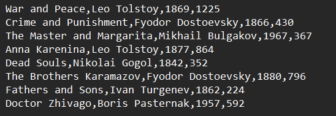
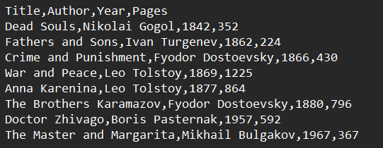

# Лабораторная работа №5

---

__Дисциплина:__   
Программирование. Язык СИ   

__Преподаватели:__   
Власов Дмитрий Викторович,   
Мельников Федор Владиславович   

__Учебное заведение:__   
РГПУ им. А. И. Герцена  

---

## Проект: Учёт книг в библиотеке  

### Описание проекта  
Программа читает список книг из файла, сортирует их по году издания и сохраняет результат в новый файл.

### Список идентификаторов  

| Имя переменной | Тип данных     | Смысловое обозначение                          |
|----------------|----------------|-----------------------------------------------|
| Book           | struct         | Структура, хранящая данные о книге            |
| title          | char[100]      | Название книги                                |
| author         | char[50]       | Автор книги                                   |
| year           | int            | Год издания книги                             |
| pages          | int            | Количество страниц                            |
| loadBooks      | int func()     | Функция для загрузки книг из файла в массив структур Book |
| sortBooksByYear| void func()    | Функция сортировки массива книг по году издания |
| saveBooks      | void func()    | Функция сохранения отсортированного списка книг в файл |
| books          | Book[]         | Массив структур Book, в который загружаются данные из файла |
| count          | int            | Количество загруженных книг                   |
| input.csv      | CSV-файл       | Входной файл с данными о книгах               |
| output.csv     | CSV-файл       | Выходной файл с отсортированными данными      |
| i, j           | int            | Параметр цикла                                |
| temp           | Book           | Промежуточная переменная                      |

## Код проекта  

### `book.h` (заголовочный файл)

```c
#ifndef BOOK_H
#define BOOK_H

typedef struct {
    char title[100];
    char author[50];
    int year;
    int pages;
} Book;

int loadBooks(const char *filename, Book *books, int max);
void sortBooksByYear(Book *books, int count);
void saveBooks(const char *filename, Book *books, int count);

#endif
```

### `book.c` (реализация функций)

```c
#include "book.h"
#include <stdio.h>
#include <string.h>

int loadBooks(const char *filename, Book *books, int max) {
    FILE *file = fopen(filename, "r");
    if (!file) return -1;
    int count = 0;
    while (count < max && fscanf(file, "%99[^,],%49[^,],%d,%d\n",
           books[count].title, books[count].author,
           &books[count].year, &books[count].pages) == 4) {
        count++;
    }
    fclose(file);
    return count;
}

void sortBooksByYear(Book *books, int count) {
    for (int i = 0; i < count; i++) {
        for (int j = 0; j < count - i - 1; j++) {
            if (books[j].year > books[j + 1].year) {
                Book temp = books[j];
                books[j] = books[j + 1];
                books[j + 1] = temp;
            }
        }
    }
}

void saveBooks(const char *filename, Book *books, int count) {
    FILE *file = fopen(filename, "w");
    if (!file) return;
    fprintf(file, "Title,Author,Year,Pages\n");
    for (int i = 0; i < count; i++) {
        fprintf(file, "%s,%s,%d,%d\n",
                books[i].title, books[i].author,
                books[i].year, books[i].pages);
    }
    fclose(file);
}
```

### `main.c` (основная программа)

```c
#include "book.h"
#include <stdio.h>

#define MAX_BOOKS 100

int main(int argc, char *argv[]) {
    if (argc < 3) {
        printf("Usage: %s <input.csv> <output.csv>\n", argv[0]);
        return 1;
    }

    Book books[MAX_BOOKS];
    int count = loadBooks(argv[1], books, MAX_BOOKS);
    if (count <= 0) {
        printf("Error: Could not load books.\n");
        return 1;
    }

    sortBooksByYear(books, count);
    saveBooks(argv[2], books, count);

    printf("Success! Sorted %d books by year.\n", count);

    return 0;
}
```

### `Makefile` (сборка)

```makefile
CC = gcc
CFLAGS = -Wall -Wextra -std=c11
TARGET = library_manager

all: $(TARGET)

$(TARGET): main.o book.o
	$(CC) $(CFLAGS) $^ -o $@

%.o : %.c
	$(CC) $(CFLAGS) -c $<

clean:
	rm -f *.o $(TARGET)
```

## Результаты выполненной работы  
### Исходный файл (`input.csv`)

 
### Отсортированный файл (`output.csv`)


---

### Информация о студенте
Лебедева Наталия, 1 курс, ИВТ-1.2
