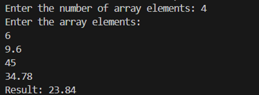
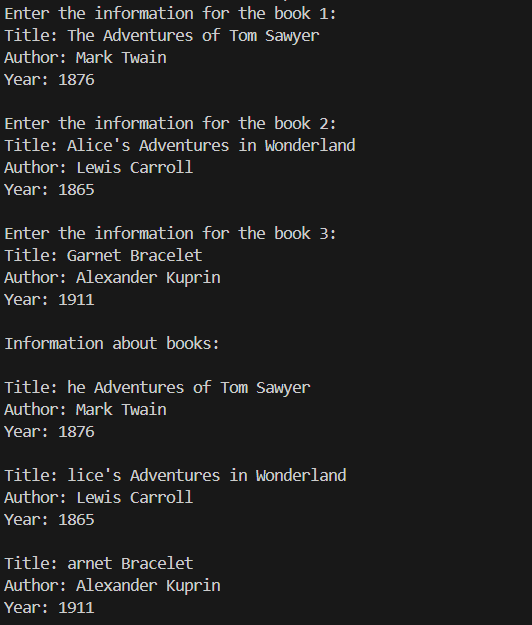
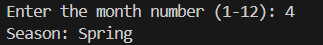

# Самостоятельная работа № 1
---

__Дисциплина:__   
Программирование. Язык СИ   

__Преподаватели:__   
Власов Дмитрий Викторович,   
Мельников Федор Владиславович   

__Учебное заведение:__   
РГПУ им. А. И. Герцена  

---

## Задание 1

### Постановка задачи
Напишите программу на языке Си, которая:  
- Запрашивает у пользователя количество элементов массива (целое число N).  
- Динамически выделяет память для массива из N элементов типа `float`.  
- Заполняет массив значениями, введёнными с клавиатуры.  
- Вычисляет и выводит среднее арифметическое всех элементов массива.  
- При обращении к элементам массива используйте арифметику указателей (без оператора []).  
- Освобождает выделенную память в конце работы программы.  

### Список идентификаторов
| Имя переменной | Тип данных | Смысловое обозначение |
| --- | --- | --- |
| N | int | Введенное значение с клавиатуры |
| A | float* | Промежуточная переменная |
| sum | float | Промежуточная переменная |
| i | int | Параметр цикла |

### Код программы
```c
#include <stdio.h>
#include <stdlib.h>

int main() 
{
    int N;
    float *A, sum = 0.0;
    printf("Enter the number of array elements: ");
    scanf("%d", &N);
    A = (float *)malloc(N * sizeof(float));
    if (A == NULL) 
    {
        printf("Memory allocation error\n");
        return 1;
    }
    printf("Enter the array elements:\n");
    for (int i = 0; i < N; i++) 
    {
        scanf("%f", A + i);
    }
    for (int i = 0; i < N; i++) 
    {
        sum += *(A + i);
    }
    printf("Result: %.2f\n", sum / N);
    free(A);
    return 0;
}
```

### Результаты выполненной работы


---

## Задание 2

### Постановка задачи
Создайте структуру `Book`, которая содержит следующие поля:  
- `title` – массив символов (строка) для хранения названия книги (максимум 50 символов);  
- `author` – массив символов для хранения имени автора (максимум 50 символов);  
- `year` – целое число, обозначающее год издания книги.  

Напишите программу, которая:  
- Создаёт массив из 3-х экземпляров структуры `Book`.  
- Запрашивает у пользователя данные для каждой книги (название, автора и год издания).  
- Выводит информацию обо всех книгах на экран, используя для этого отдельную функцию `printBook()`, которая принимает указатель на структуру `Book`.  

### Список идентификаторов
| Имя переменной | Тип данных | Смысловое обозначение |
| --- | --- | --- |
| Book | struct | Структура |
| title | char[50] | Поле структуры |
| author | char[50] | Поле структуры |
| year | int | Поле структуры |
| printBook | void | Функция |
| books | struct Book[3] | Массив |
| i | int | Параметр цикла |

### Код программы
```c
#include <stdio.h>
#include <string.h>

// Определение структуры Book
struct Book 
{
    char title[50];
    char author[50];
    int year;
};

void printBook(struct Book *book) 
{
    printf("Title: %s\n", book->title);
    printf("Author: %s\n", book->author);
    printf("Year: %d\n", book->year);
}

int main() 
{
    struct Book books[3];
    for (int i = 0; i < 3; i++) 
    {
        printf("Enter the information for the book %d:\n", i + 1);
        printf("Title: ");
        getchar(); // Очищаем буфер от символа '\n'
        fgets(books[i].title, sizeof(books[i].title), stdin); // Считываем строку с названием книги
        books[i].title[strcspn(books[i].title, "\n")] = '\0'; // Удаляем символ новой строки '\n'
        printf("Author: ");
        fgets(books[i].author, sizeof(books[i].author), stdin); 
        books[i].author[strcspn(books[i].author, "\n")] = '\0'; 
        printf("Year: ");
        scanf("%d", &books[i].year); 
        getchar(); 
        printf("\n");
    }
    printf("Information about books:\n\n");
    for (int i = 0; i < 3; i++) 
    { 
        printBook(&books[i]); 
        printf("\n");
    }
    return 0; 
}
```

### Результаты выполненной работы


---

## Задание 3

### Постановка задачи
Создайте перечисление `Season` со следующими значениями:  
- WINTER, SPRING, SUMMER, AUTUMN  

Напишите программу, которая:  
- Запрашивает у пользователя номер месяца (целое число от 1 до 12).  
- На основе введённого номера месяца определяет и выводит соответствующий сезон:  
  - Зима: декабрь (12), январь (1) и февраль (2);  
  - Весна: март (3), апрель (4) и май (5);  
  - Лето: июнь (6), июль (7) и август (8);  
  - Осень: сентябрь (9), октябрь (10) и ноябрь (11).  
- Для определения сезона можно использовать условные операторы (`if-else`) или конструкцию `switch`.  

### Список идентификаторов
| Имя переменной | Тип данных | Смысловое обозначение |
| --- | --- | --- |
| month | int | Введенное значение с клавиатуры |
| season | enum Season | Переменная для хранения текущего сезона |
| seasonNames | const char * | Массив |

### Код программы
```c
#include <stdio.h>

// Определение перечисления Season
enum Season  
{
    WINTER, 
    SPRING,
    SUMMER,  
    AUTUMN 
};

int main() 
{
    int month;
    enum Season season; // Переменная для хранения сезона
    printf("Enter the month number (1-12): ");
    scanf("%d", &month); 
    switch (month) // Определяем сезон по номеру месяца
    {
        case 12:
        case 1:
        case 2:
            season = WINTER;
            break;
        case 3:
        case 4:
        case 5:
            season = SPRING;
            break;
        case 6:
        case 7:
        case 8:
            season = SUMMER;
            break;
        case 9:
        case 10:
        case 11:
            season = AUTUMN;
            break;
        default:
            printf("Incorrect month number\n");
            return 1;
    }
    const char *seasonNames[] = {"Winter", "Spring", "Summer", "Autumn"}; // Массив названий сезонов
    printf("Season: %s\n", seasonNames[season]); // Выводим название сезона по значению переменной season
    return 0;
}
```

### Результаты выполненной работы


---

### Информация о студенте
Лебедева Наталия, 1 курс, ИВТ-1.2
